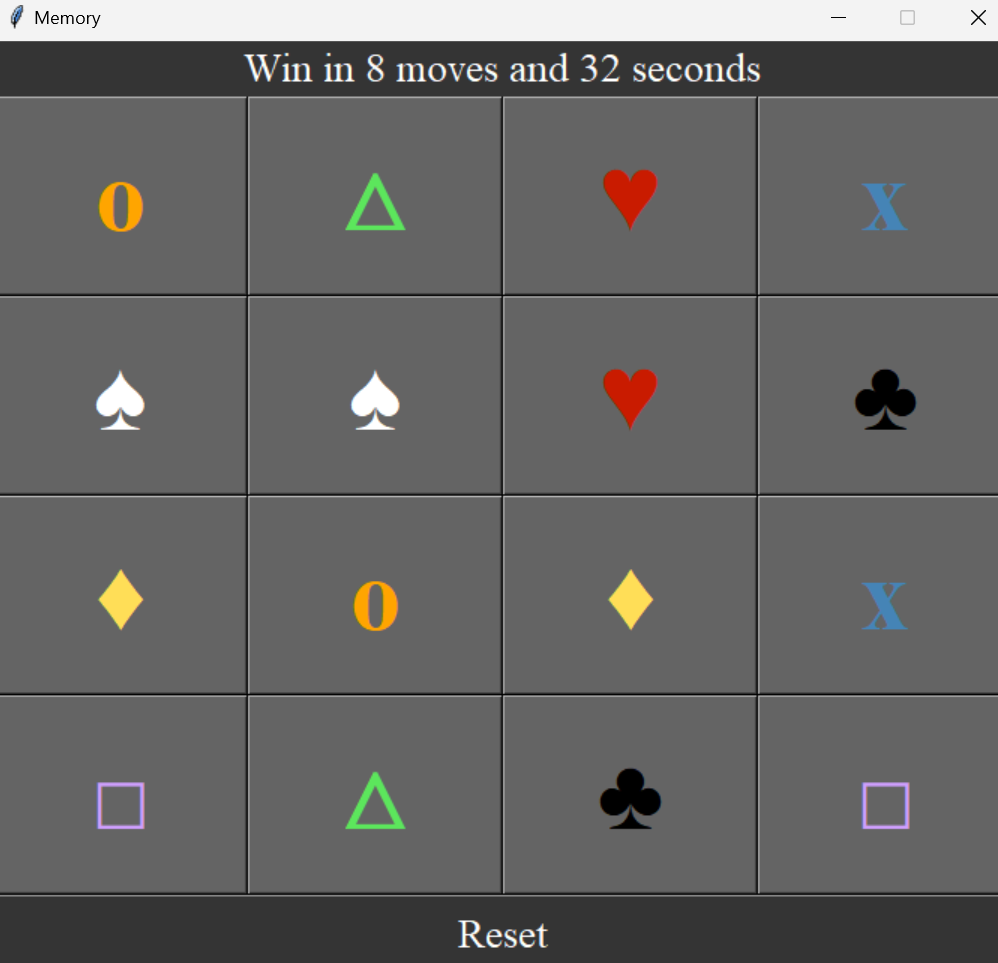

# Memory
This repository implements the famous memory game using Python and Tkinter. <br>
Match the 8 pairs in the fewest moves and shortest time possible. to win the game!
<div style="display: flex; justify-content: center;">
    
</div>

If you want, you can create an executable. Install pyinstaller and run this command:
```
pyinstaller --onefile --NOCONSOLE memory.py
```